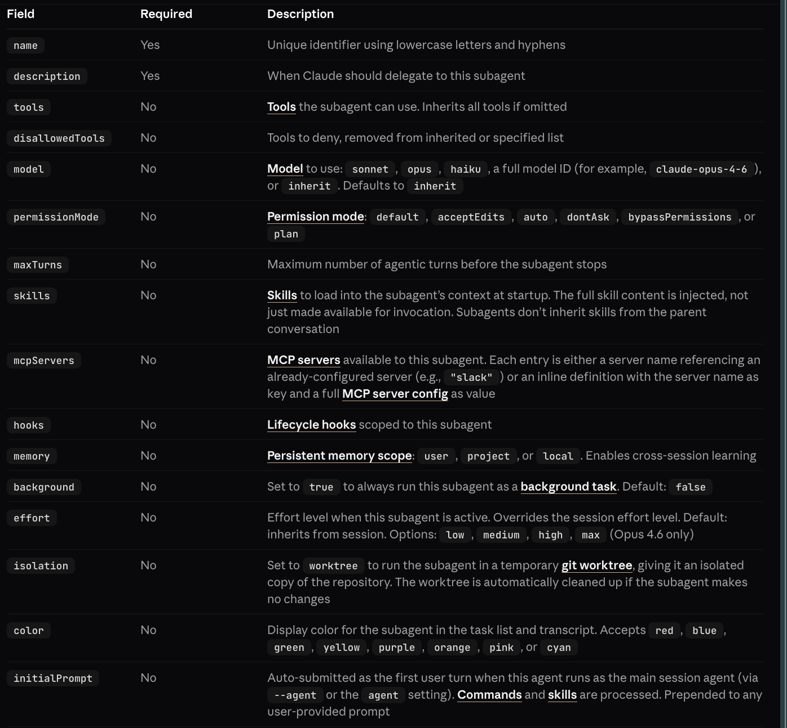
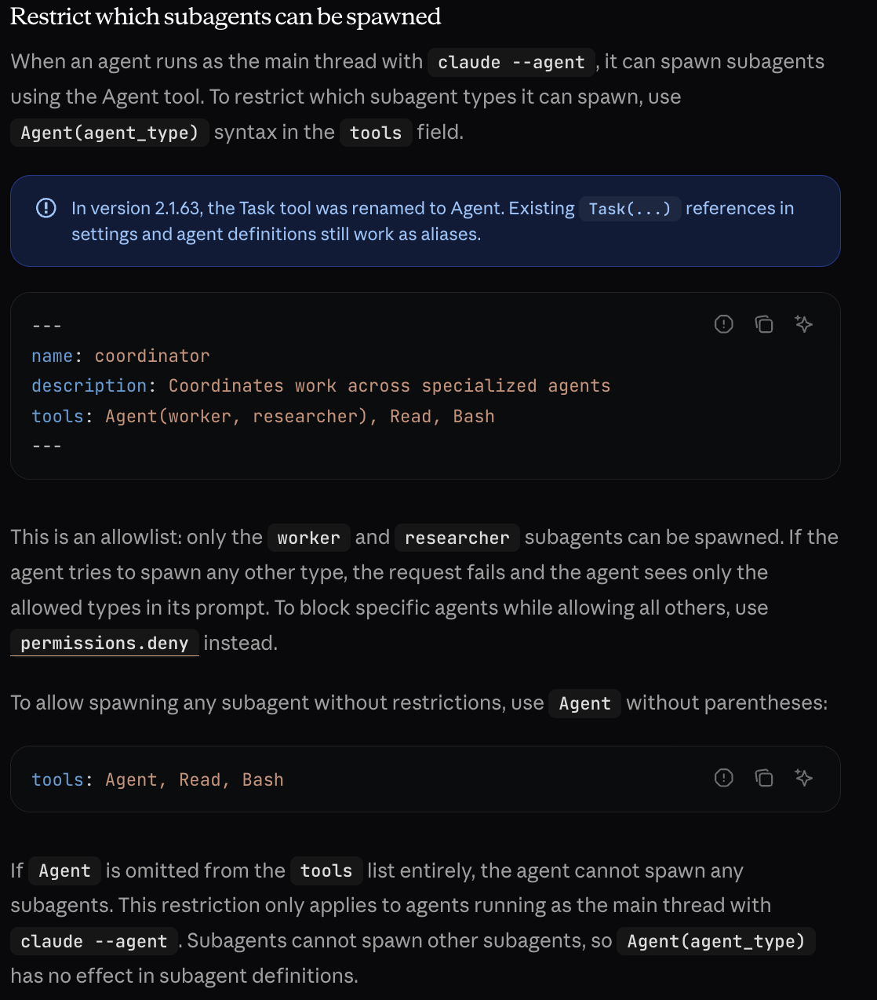
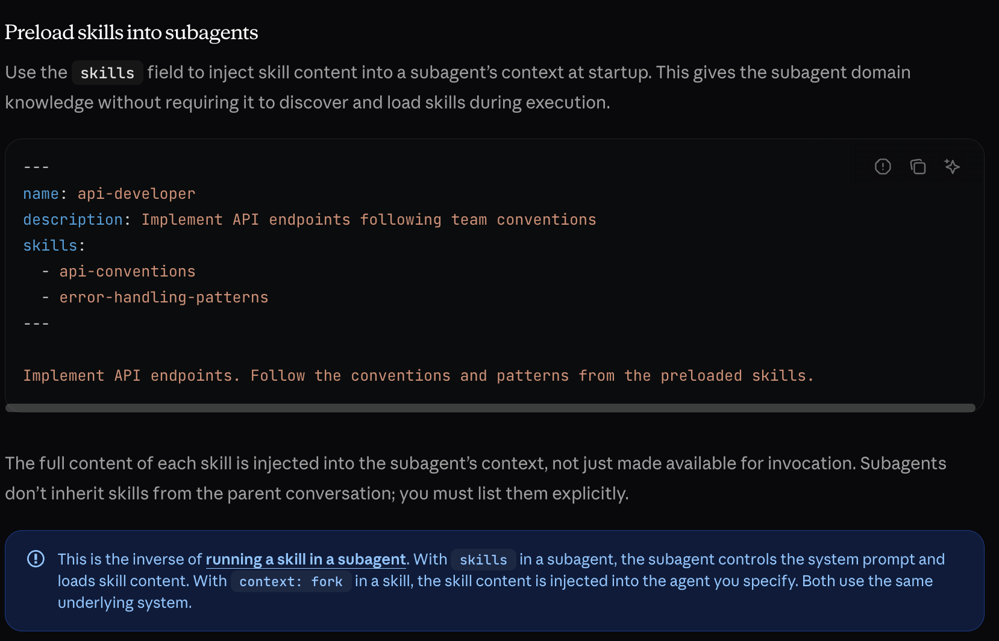
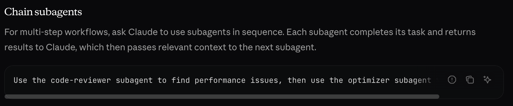
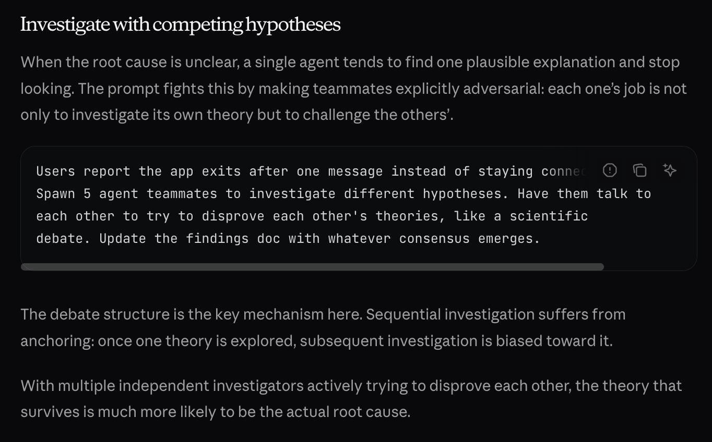

## PRD
- Experiments layer to be added and will be later generalised such that it can be turned on/off as needed.
- Writing in an 'article' format as a finished research paper is out of scope right now.
- Add git automated commits so that memory is persisted even when new agents are drawn up.
- SubAgents to be defined with minimal context (memory) cost, specific tool usage, clear memory persistence (resume subagent?), hooks (as necessary with context compactness commands as needed) and hyper specialised task.
- Have 3 types of Sub-agents. Base workers, Interim Managers (Connect base-workers with Top workers), Top workers, Main orchestrator (MD). Like an actual research organization.
- Add a layer for viewing the critical decision making outputs (prespective that there is actual a research gap, or clashes bw 2 claims, etc.) using another agent with no bias (work out how that no-bias agent would be created)
- Create real checklists for each agent and a hierarchial level checklist also.
- Create scopes for each agent as to which dirs they can read or write, and common files where they can interact with to communicate with each other since subagents dont have a way to communicate with each other (like in Agentt Teams. Also find out the cases that this might even be necessary to do) to move forward. Needs to be designed in a way such that iteration can improves the results meaningfully. Decide which step of the workflow even needs this interaction-between-subagents layer and write the architecture such that it's only active for that period.
- Scope: 
    - Collect Relevant Papers
    - Understand research space (development over the timeline, cutting-edge right now)
    - Find research gaps
    - Define each research gap rigourously and give scores on the basis of research impact, easiness to research (ease of writing/conducting experiments), etc.
    - Write Hypothesis with revelant methods for DOE.
- Upcoming Scope:
    - Write Code for the experiments and run it.
    - Iterate Experiments till satisfactory output is achieved.
    - Add intelligence layer to understand the output and compare it with current research work to complete the results.
    - Set the narrative for the results achieved and analysizs the output.
    - Re-iterate if necessary till Hypothesis is proven/disproven with confidence.
- Out of Scope:
    - Write full-fledged paper.
    - AI proof it.

## Overview of how Agentic feature will be used. 

**Skills:** Rules-like content that that enchances the workflow of Agents.
- Set skills up in such a manner that reference files are read in a if-else, staged manner in order to save context.

https://agentskills.io/skill-creation/best-practices
https://agentskills.io/specification
https://code.claude.com/docs/en/skills

**Agents:** Workflow orchestrators that are incharge of one particular-step of the workflow with access to the necessary Skills. All will run with a seperate context completely as subagents. All will run with sonnet, except the most critical one that requires critical thinking to Opus. Set up configs.
https://code.claude.com/docs/en/sub-agents

Check this out: https://code.claude.com/docs/en/sub-agents#resume-subagents

**Memory:** 
- Claude.md: To describe the entire workflow step-by-step and how to run itn and it's purpose. (minimal/applicable across agents/skills/workflow-step)
- Rules: Hard-rules for each step. Will be rare. But stuff like python path, etc. maybe? 

<!-- ## TODO
- "/.claude/rules/python-env.md":  Add to Rules.
- "/.claude/rules/force_verbosity.md": Merge with the write-textbook-chapter agent/skill.
- "/.claude/rules/semantic-coloring.md": Turn into an optional agent/skill that can be applied as per the user's discretion.
- "/.claude/rules/source-integrity.md": Understand how to process it as a post-processing step (in whichever step it's applicable).
-  -->