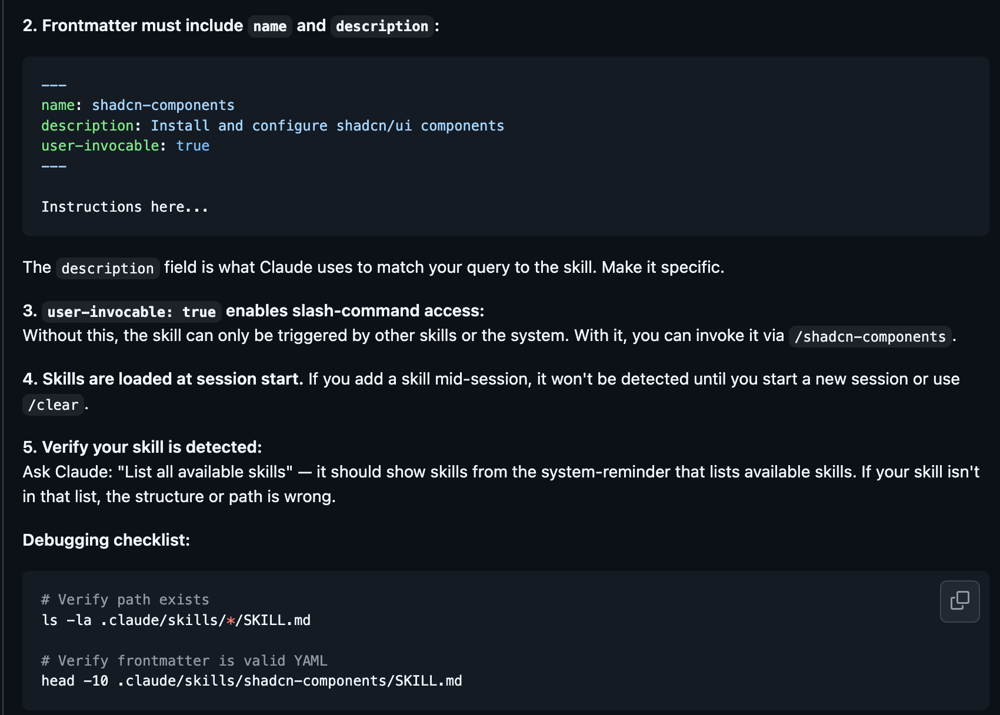
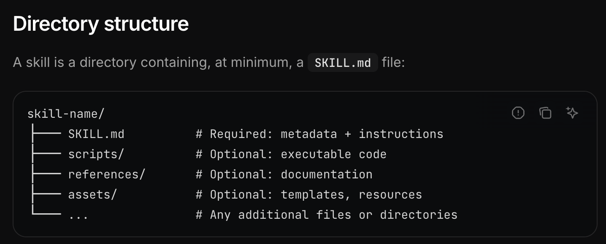
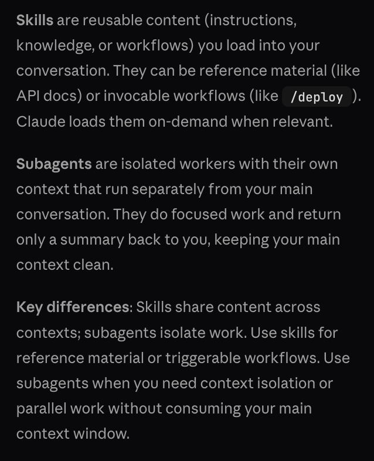
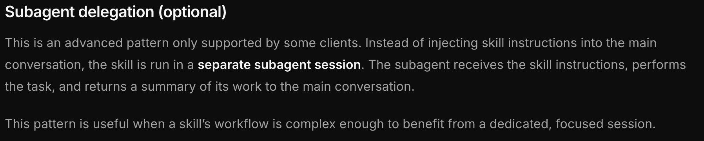

## Overview of how feature will be used. 

**Skills:** Rules-like content that that enchances the workflow of Agents.
- Set skills up in such a manner that reference files are read in a if-else, staged manner in order to save context.

https://agentskills.io/skill-creation/best-practices
https://agentskills.io/specification

**Agents:** Workflow orchestrators that are incharge of one particular-step of the workflow with access to the necessary Skills. All will run with a seperate context completely as subagents. All will run with sonnet, except the most critical one that requires critical thinking to Opus. Set up configs.

**Memory:** 
- Claude.md: To describe the entire workflow step-by-step and how to run itn and it's purpose. (minimal/applicable across agents/skills/workflow-step)
- Rules: Hard-rules for each step. Will be rare. But stuff like python path, etc. maybe? 

## TODO
- "/.claude/rules/python-env.md":  Add to Rules.
- "/.claude/rules/force_verbosity.md": Merge with the write-textbook-chapter agent/skill.
- "/.claude/rules/semantic-coloring.md": Turn into an optional agent/skill that can be applied as per the user's discretion.
- "/.claude/rules/source-integrity.md": Understand how to process it as a post-processing step (in whichever step it's applicable).
- 